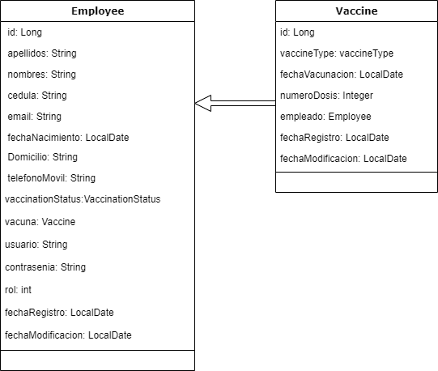
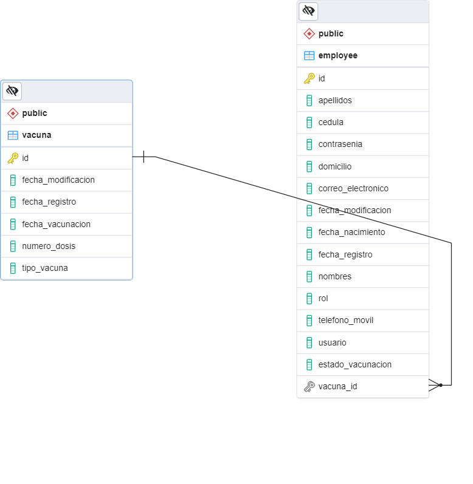

# Registro del inventario de estado de vacunación de empleados

API REST para llevar un registro del inventario del estado de vacunación de los empleados
de la empresa Kruger Corporation, con base en el lenguaje JAVA, Spring Boot y PostgreSQL.


## Condiciones

1. La aplicación cuenta con 2 roles: Administrador y Empleado.
2. El Administrador contará con las opciones registrar, editar, listar y eliminar a los empleados.

Además el administrador cuenta con los métodos de:

2.1 Filtrar por estado de vacunación.

2.2 Filtrar por tipo de vacuna.

2.3 Filtrar por rango de fecha de vacunación.

3. Como Empleado se requiere visualizar y actualizar la información.

## Diagrama de clases

A continuciación se observan las clases que intervinieron en la ejecución del proyecto:



## Modelo de Datos

Según el análisis realizado el modelo quedaría de la siguiente manera:



En el proyecto dentro del directorio "enumerator" se incluyen dos campos del tipo enum, dentro de las clases Employee y Vaccine.

* Para la clase "Employee" en el campo "vaccinationStatus" los valores permitidos son: [VACUNADO, NO_VACUNADO]
* Para la clase "Vaccine" en el campo "vaccineType" los valores permitidos son: [SPUTNIK, ASTRA_ZENECA, PFIZER, JHONSON_AND_JHONSON]

## Construcción del Proyecto

###  Dependecias/Herramientas utilizadas

- org.springframework.boot:spring-boot-starter-data-jpa
- org.springframework.boot:spring-boot-starter-validation
- org.springframework.boot:spring-boot-starter-web
- org.mapstruct:mapstruct:1.4.2.Final
- org.postgresql:postgresql
- org.projectlombok:lombok
- org.xmlunit:xmlunit-core
- io.springfox:springfox-swagger2:2.9.2
- io.springfox:springfox-swagger-ui:2.9.2
- io.swagger.parser.v3:swagger-parser:2.0.21
- org.springframework.boot:spring-boot-starter-security
- io.jsonwebtoken:jjwt-api:0.11.5
- io.jsonwebtoken:jjwt-impl:0.11.5
- io.jsonwebtoken:jjwt-jackson:0.11.5

* Java 11
* Maven 4.0.0
* Spring Boot 2.5.6
* PostgreSQL 13.4
* IDE: IntelliJ IDEA 2021.2.1 (Community Edition)

### Ejecución del Proyecto

#### Pasos:

1) Descargar el Proyecto y abrirlo con su IDE de preferencia.

Nota.- Esperar hasta que se actualicen todas las dependencias a través de `Maven`.

2) Crear una base de datos PostgreSQL con el nombre `BaseDatosVacunacionEmpleados`.

3) Configurar las credenciales de acceso a la base de datos en el archivo `application.properties` dentro de `src/main/resources/`.
    Personalizar las variables `spring.datasource.username` y `spring.datasource.password` según su configuración de PostgreSQL.

## Ejecución de la Aplicación

#### Pasos:

1) Ingresar al archivo `ProyectoVacunacionApplication` dentro de `src/main/java/proyecto/proyecto_vacunacion/ProyectoVacunacionApplication`.

2) A continuación dar clic sobre el botón ejecutar.

3) Esperar a que la aplicación compile y se ejecute.

## Acceder a la Documentación

#### Pasos

1) En un navegador web, ingresar a la siguente url:
```
http://localhost:8080/api/ve/swagger-ui/index.html
```

2) Se le va a pedir un usuario y contraseña

El proyecto esta configurado de tal manera que el rol=1 es para un administrador y el rol=2 es para un empleado

Dicho esto vamos a ejecutar el siguiente script en la base de datos
```
INSERT INTO employee(apellidos, cedula, contrasenia, domicilio, correo_electronico,fecha_nacimiento,nombres, rol, telefono_movil, usuario)
VALUES ('Garcia', '1234567890', 'password', 'Calle 1, Cuenca', 'ejemplo1@correo.com','1990-02-12','Juan', 1 , '5551234567','admin' );
```
Teniendo ya un administrador en la base de datos se puede proceder con sus respectivas credenciales a logiarse `usuario`:`admin`, `contrasenia`:`password`y 
crear empleados como tambien consultar sus respectivos métodos.

3) Explorar los `endpoints` para el rol `ADMINISTRADOR` y para el rol `EMPLEADO`.
Hay que tener en claro que los endpoints están restringidos tanto para que solo el administrador pueda acceder a cierta información concerniente a su cargo,
como de igual manera el empleado solo tiene la posibilidad de poder modificar su propia información. 


